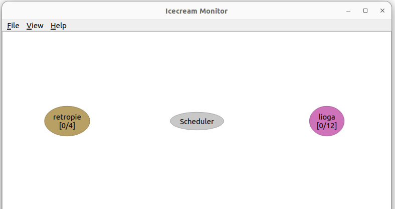

Recently, I was working with ROS on a Raspberry Pi for my graduation project. I'll post more about it later. I encountered a problem: the Raspberry Pi is very slow at compiling. For example, while building a ROS package, I cooked, ate, did the dishes, and came back. After one and a half hours, the build still wasn't finished.

I started thinking about how to speed up the building process. I found out that the one effective solution is distributed compiling.

# What is distributed compiling?

Distributed compiling involves spreading the compilation process across multiple machines. This can significantly reduce the time it takes to compile projects on resource limited machines. Distributed computing can be used to distribute the compilation tasks to other more powerful computers on the network. These tools send portions of the code to be compiled on different machines, which then return the compiled code back to the Raspberry Pi. This way, the overall load is shared, and the compilation process is accelerated.

By leveraging the power of distributed compiling, even resource-limited devices like the Raspberry Pi can handle complex builds more efficiently.

# So what do we need?

We need:

- a tool to distribute our compile jobs like distcc or icecream
- a cross compiler for the target architecture.

Since the Raspberry Pi has a different architecture (ARM) than most desktop or server machines (x86), you need a cross-compiler that can generate ARM-compatible binaries on these machines. A cross-compiler is a compiler configured to generate executable code for a different architecture than the one it runs on.

# Personal experience about distcc and icecream

I struggled with the installation of distcc and couldn't get it work properly. I could see that the packages were being sent and received between machines, but the compile jobs always failed. To troubleshoot, I isolated the cross-compiler and tested it separately by compiling a simple "Hello, World!" program. After transferring the compiled program to the Raspberry Pi, it worked perfectly. This indicated that the cross-compiler itself was functional, but there were issues with how distcc was handling the compilation process.

When I tried to get help with distcc, I felt like I had stumbled into a digital time capsule. Most of the forum posts and troubleshooting guides were from 2005! It was clear that distcc has been around for a long time, and its documentation and community support might not have kept pace.

That's when I discovered [icecream](https://github.com/icecc/icecream):

> Icecream was created by SUSE based on distcc. Like distcc, Icecream takes compile jobs from a build and distributes them among remote machines allowing a parallel build. But unlike distcc, Icecream uses a central server that dynamically schedules the compile jobs to the fastest free server. This advantage pays off mostly for shared computers, if you're the only user on x machines, you have full control over them.

Switching to icecream resolved the issues I was experiencing with distcc. Installation was quick and straightforward, without the hassle I encountered before. What really impressed me was the debugging and monitoring features. I could easily track the jobs moving between machines, which made the whole process more transparent and manageable.

So, let's dive into installation!

# Installation

### Debian Based Systems

You can install icecc from the package manager:

```bash
$sudo apt install icecc
```

You have to install icecc for all the machines that you want to use for distributed compiling.

### Compile it from sources

Or you can compile it from [sources](https://github.com/icecc/icecream). However, you need to install the dependencies first.

# Running Scheduler

As can be seen from the above, icecc has a scheduler that manages the distribution of compile jobs. You can run the scheduler on your host machine by:

```bash
$sudo icecc-scheduler
```

# Launching Deamon

After installation, the daemons are working on the both host computers and Raspberrry Pi since the systemd unit is enabled by default on Debian-based systems. You can check it by:

```bash
$systemctl status iceccd.service
```

If it is not active you have to start it:

```bash
$sudo systemctl start iceccd
```

Also, you can enable the daemon at startup time:

```bash
$sudo systemctl enable iceccd
```

This daemon will find scheduler in local network by itself. However, if there is more than one scheduler in the network, or the scheduler isn't on the local network you can specify the ip address of the scheduler for the daemon:

```bash
$sudo iceccd -s <ip_scheduler>
```

Or you can edit _ICECC_SCHEDULER_HOST_ in the configuration file _/etc/icecc/icecc.conf_.
Please note that you can also change the _ICECC_MAX_JOBS_ to increase max job count, its default is the number of cores of the node, and you can change the default log folder if you want.

# Enable Icecc Compilation

### (Optional) With ccache

Ccache is another good tool to speed up the compilation process.

> Ccache is a compiler cache. It speeds up recompilation by caching previous compilations and detecting when the same compilation is being done again.

You can install it on Raspberry Pi by:

```bash
$sudo apt install ccache
```

After that in your .bashrc add

```bash
export CCACHE_PREFIX=icecc
```

to the end of the file.

### Without ccache

At the end of .bashrc file in Raspberry Pi add

```bash
export PATH=/usr/lib/icecc/bin:$PATH
```

# Cross Compiler

On your host machine you need a cross compiler. To cross-compile for Raspberry Pi you can binaries for different systems [here](https://github.com/abhiTronix/raspberry-pi-cross-compilers/wiki).

First look at your debian version on Raspberry Pi by

```bash
$lsb_release -a
```

and then check your gcc version

```bash
$gcc --version
```

After that click which version suits for you under the toolchain downloads and download cross compiler on your host computer, extract it.

Next you need to create an icecream environment to tell icecream that it has to use the cross-compiler instead of the usual compiler present on the system. That can be done by running the following command:

```bash
$icecc-create-env --gcc <your_cross_compiler_location>/bin/arm-linux-gnueabihf-gcc <your_cross_compiler_location>/bin/arm-linux-gnueabihf-g++
```

This will create a tar.gz file with the environment, which you then have to copy over to each Raspberry Pi where you will run jobs from.

You can use scp to copy that to your Raspberry Pi:

```bash
$scp <hash>.tar.gz <remote_username>@<remote_ip>:/home/<remote_username>
```

After you copied the tar.gz file you need to export it on .bashrc in Raspberry Pi:

```bash
export ICECC_VERSION=x86_64:~/<hash>.tar.gz
```

This is it. To check if it is working first be sure that scheduler is running, if not then run the icecc-scheduler:

```bash
$sudo icecc-scheduler
```

Install the icecream monitor on your host machine:

```bash
$sudo apt install icecc-monitor
```

Run the icecream monitor to see that nodes are ready.

```bash
$icemon
```

It has to look something like this:



When you start a compile job in Raspberry Pi, icecream will distrubute it to the other machines on the network.

A final note: For some tasks icecream may create disadvantageous situation because of the overhead it adds. See the [Some Numbers Section](https://github.com/icecc/icecream?tab=readme-ov-file#some-numbers).
