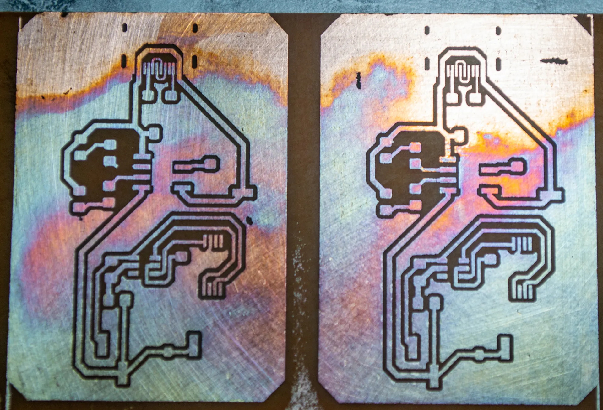
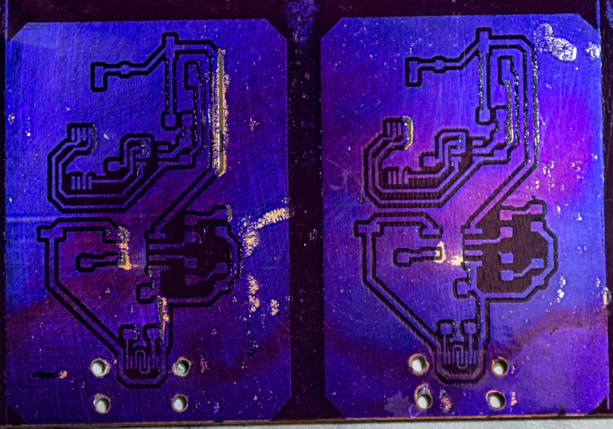
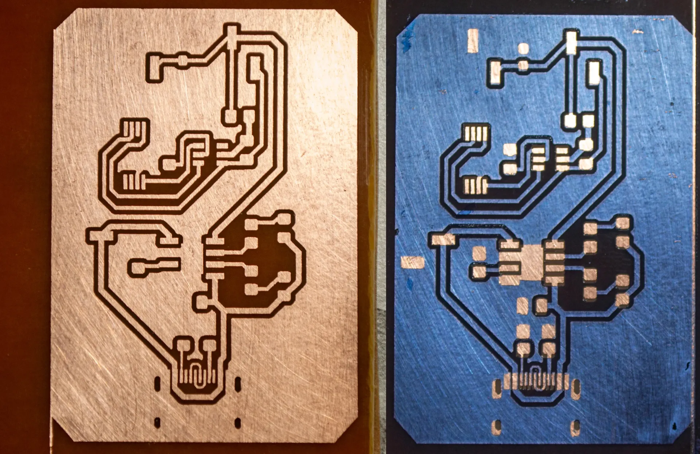
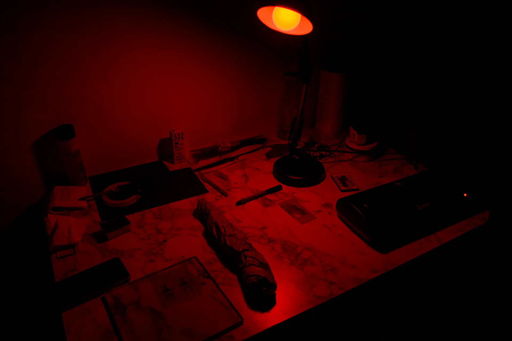
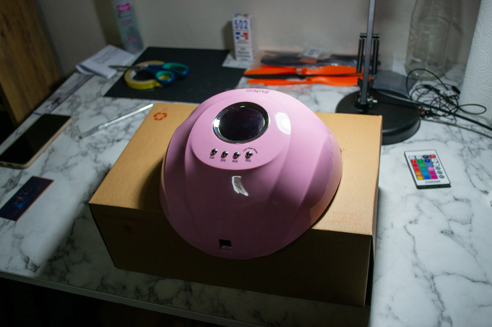
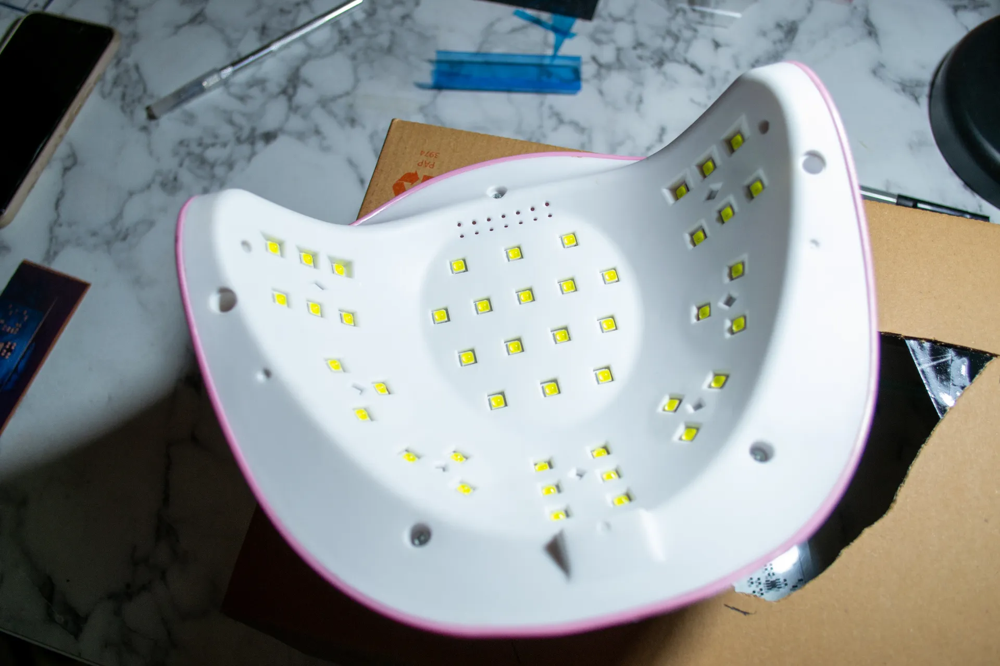
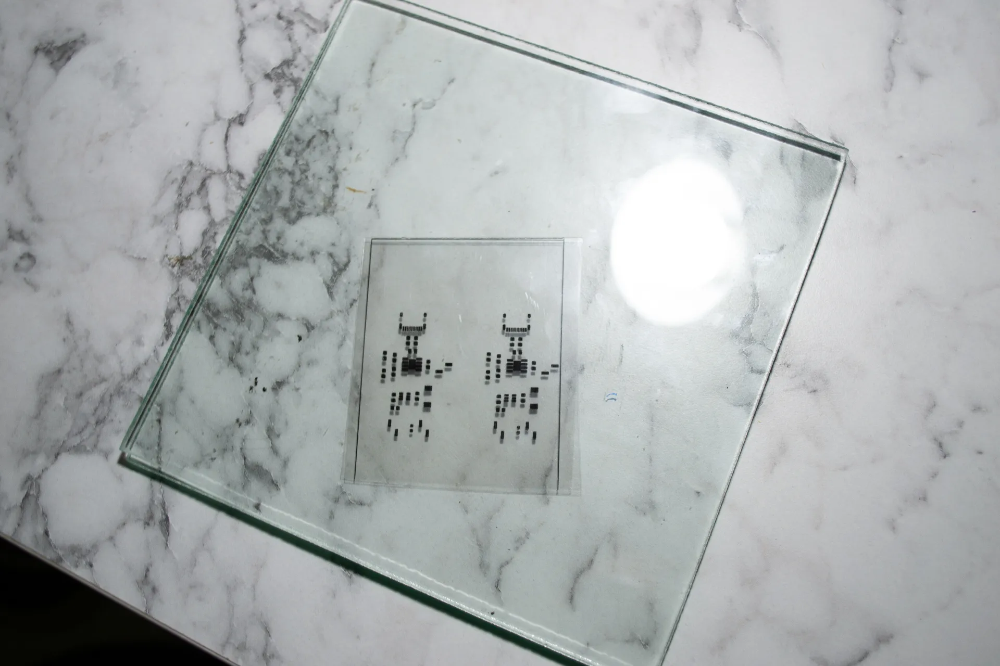
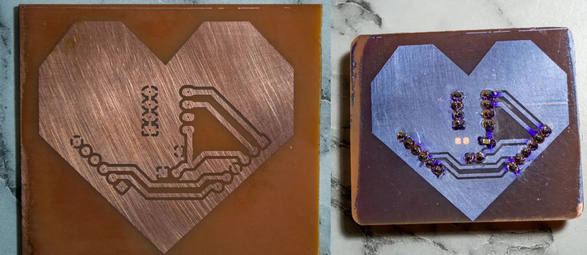
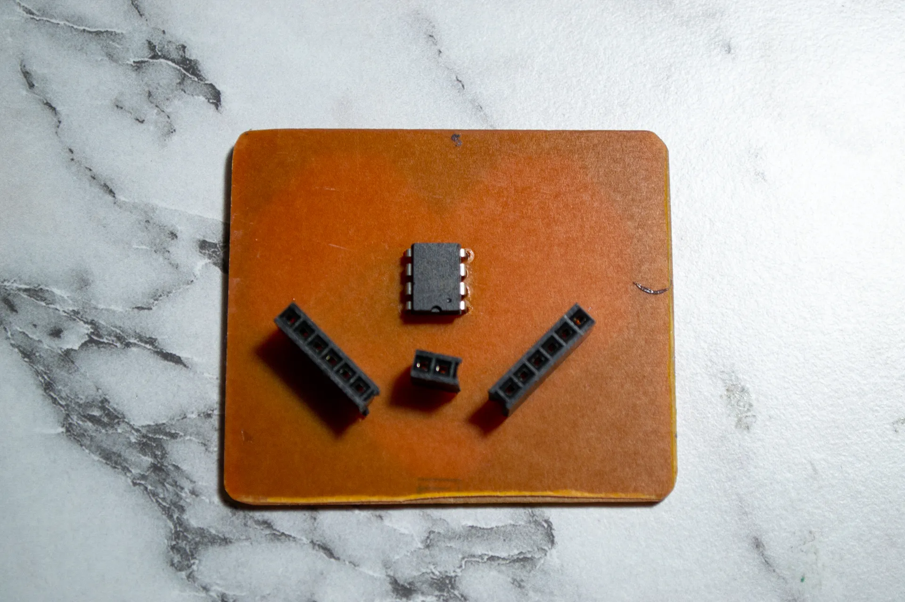

## Introduction

The goal of this project is to produce PCBs at home, starting with simple boards and gradually advancing to more complex ones. The significance of this project lies in its ability to breathe life into other projects, as it will enable the creation of boards with USB interfaces, displays, and various peripherals. I'll keep this post updated with the project's progress.

## My PCB Manufacturing Process

1. Print the top and bottom layer on a laser-jet printer to the magazine paper.
2. Put it on the copper plate, which is cleaned with steel wool.
3. Run through the laminator 10 times.
4. For the etching solution, in a ceramic or glass bowl:
   Half hydrogen-peroxide, half Hydrochloric acid.
5. Clean again with acetone and steel wool.
6. Mark the holes, then drill.

At this point, the PCB is ready to use, rest of the steps for adding solder mask layer

7. Put solder resist film on the PCB and cut sides; the film will stick.
8. Run through the laminator three times.
9. Print the top solder mask layer to the transparency paper.
10. Tape transparency paper on glass, put the PCB under the glass, align the top layer and solder mask.
11. Expose it to UV light.
12. Make sodium carbonate from sodium bicarbonate by heating or use sodium carbonete, can be find as washing soda.
13. Proof the solder mask layer, dissolve pads.

## First Attempt: Failed

As today, April 4th, I have all the materials I need. I wanted to print a lithium battery charging PCB with USB Type-C.

My initial attempt has failed catastrophically.

#### What went wrong?

Couple of things went wrong. First one is the lamination process. Because I gave the copper plate with the magazine paper to the laminator in so many different angles at the start of the process, the paper on it became wrinkled. Also, I should have used a better magazine paper, because the one I used left its paint on the board.

Another issue was the etching solution. I made a big mistake by trusting my eyes. I didn't measure the amounts of the chemicals I used. I just poured them into the bowl. Additionally, I shake the bowl too aggressively and the solution react too fast. It bubbled a lot and eat all the copper on the board as it is seen in the picture.

#### What's next?

Next week, I will:

1. Find a better magazine paper.
2. Make lamination process more controlled.
3. Measure the amounts of the chemicals I use.
4. Definitely use plastic gloves instead of plastic bag.

## Second Attempt: Partially Successful

PCB etching process went smoothly. I used a better magazine paper and I was more careful with the lamination process. I also measured the amounts of the chemicals I used. I wanted a very slow etching process so I pour 3 part hydrogen peroxide and 1 part hydrochloric acid. I think result is pretty good for the small type-c routes.

After that I prepared the solder-mask, stick it to the PCB, and pass through the laminator 3 times. I should have been more careful while putting the dry film onto PCB. Because of the air bubbles, some parts of the dry film teared off. After that, I expose PCB to the UV light with a transparent paper that has pads printed on top. However, I exposed PCB too much and the dry film became too hard to remove. I tried to remove it with sodium carbonate but it didn't work. So, all the pads are closed. I think I should have exposed it less.

I will be testing it with different exposure times next week. Also, I will share my UV light setup.

## Success on One Layer PCBs

I have been working on this project for a while now. I have made a lot of mistakes and learned a lot. Finally, I have been able to produce one layer PCBs successfully with this method.

### What was my mistakes?

#### In the etching process:

- My etcing solution was too strong and fast. I diluted hydrogen peroxide with water and achieved more controlled etching process. The traces came out crystal clear.

#### In the dry film process:

- I try to make everything pitch dark. I couldn't see anything and I made mistakes while stitching dry film and aligning transparency paper on the board. I solved this problem with a red light setup.

- The UV light was way too strong, so I had to get creative. I grabbed a shoebox and stuck the UV light on top of it. But there was still another problem – the light was spilling onto the board from the sides. So, I cut out just the middle part of the shoebox. Now, it only lets in the UV light that's coming straight from the source. Problem solved!

- Transparency paper was allowing light to pass through it. I solved this problem by printing the solder mask layer both on the top and bottom of the transparency paper then fold it. So I stacked two layers of transparency paper on top of each other.

### Gift for My Girlfriend

I decided to create a special gift for my girlfriend, so I designed a heart-shaped PCB with an embedded EEPROM. I wrote down some of our favorite shared memories and activities, and even added a basic menu for accessing different addresses in the EEPROM. Using the same method, I produced the PCB, and I'm really pleased with how it turned out.

### What's next?

I will be working on two layer PCBs next. I will be using the same method. If I can get good results with vias, I will be starting to work on a retro handheld game console.
