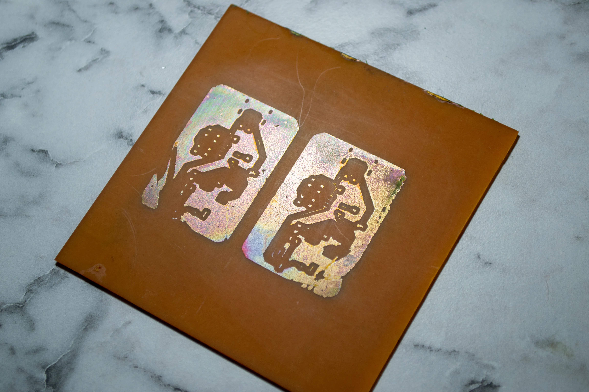

## Introduction

The goal of this project is to produce PCBs at home, starting with simple boards and gradually advancing to more complex ones. The significance of this project lies in its ability to breathe life into other projects, as it will enable the creation of boards with USB interfaces, displays, and various peripherals. I'll keep this post updated with the project's progress.

## My PCB Manufacturing Process

1. Print the top and bottom layer on a laser-jet printer to the magazine paper.
2. Put it on the copper plate, which is cleaned with steel wool.
3. Run through the laminator 10 times.
4. For the etching solution, in a ceramic or glass bowl:
   Half hydrogen-peroxide, half Hydrochloric acid.
5. Clean again with acetone and steel wool.
6. Mark the holes, then drill.

At this point, the PCB is ready to use, rest of the steps for adding solder mask layer

7. Put solder resist film on the PCB and cut sides; the film will stick.
8. Run through the laminator three times.
9. Print the top solder mask layer to the transparency paper.
10. Tape transparency paper on glass, put the PCB under the glass, align the top layer and solder mask.
11. Expose it to UV light.
12. Make sodium carbonate from sodium bicarbonate by heating or use sodium carbonete, can be find as washing soda.
13. Proof the solder mask layer, dissolve pads.

## First Attempt: Failed

As today, April 4th, I have all the materials I need. I wanted to print a lithium battery charging PCB with USB Type-C.

My initial attempt has failed catastrophically.

#### What went wrong?

Couple of things went wrong. First one is the lamination process. Because I gave the copper plate with the magazine paper to the laminator in so many different angles at the start of the process, the paper on it became wrinkled. Also, I should have used a better magazine paper, because the one I used left its paint on the board.

Another issue was the etching solution. I made a big mistake by trusting my eyes. I didn't measure the amounts of the chemicals I used. I just poured them into the bowl. Additionally, I shake the bowl too aggressively and the solution react too fast. It bubbled a lot and eat all the copper on the board as it is seen in the picture.

#### What's next?

Next week, I will:

1. Find a better magazine paper.
2. Make lamination process more controlled.
3. Measure the amounts of the chemicals I use.
4. Definitely use plastic gloves instead of plastic bag.
