# Introduction

For our graduation project, we decided to focus on the field of quadrotors, because flying things always are intriguing for us. Our primary goal was to develop a test-bench to experiment with various control algorithms. In addition to evaluating these control systems, we aimed to create cyber attack scenarios to assess and compare the resilience of different controllers under such conditions.

Our test-bench was designed to allow three-axis rotation (pitch, roll, yaw) and single-axis displacement (z-axis), providing it with four degrees of freedom. This setup enabled us to simulate cyber attacks, including False Data Injection (FDI), Denial of Service (DoS), and Ramp attacks. By conducting these experiments, we could observe and measure the response performance of different control algorithms, specifically focusing on linear control techniques like PID and PI. You can see one example about these scenarios below in the video.

<script>
  import { YouTube } from 'sveltekit-embed'
</script>

<YouTube youTubeId="v-5AVn8u_QA" />

<br />

In this video, we provided the drone with sinusoidal attitude commands on the roll axis while keeping the pitch and yaw at zero. The PID controller without any attack follows the command. However, the PID controller under a DoS attack occasionally stutters.

Lastly, we analyzed key performance metrics such as Integral Absolute Error (IAE), Integral Time-weighted Absolute Error (ITAE). Our findings revealed that PID controllers generally demonstrated better performance compared to PI controllers across different cyber-attack scenarios.

An exciting aspect of our project is its educational impact. The test-bench we developed will be used in the Control Systems Laboratory at Karadeniz Technical University. This hands-on tool allows undergraduate students to visualize and implement theoretical concepts, such as adjusting PID controller parameters to see changes in system behavior. It will also be a valuable resource for graduate and doctoral students conducting advanced research in control engineering.

# Our Test-bench Build

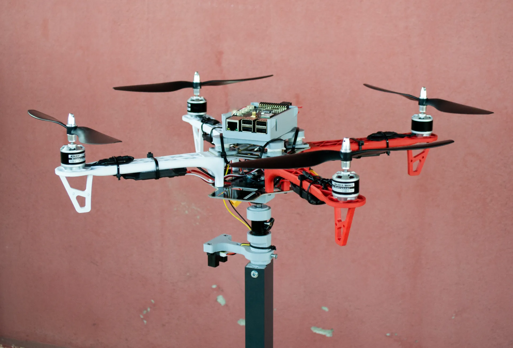

For the base of the test-bench, we visited an industrial area in Trabzon, Turkey. We presented the plans to a shop owner there. He immediately started brainstorming how to construct our design and began working on the project right away. Concerned about our tight budget, I tried to ask about the cost:

> How much it will c...

He interrupted me and said:

> Did I tell you anything about money? Just tell me what you want, you'll design it, and I'll handle the manufacturing.

So, we returned home with the aluminum base that day.

<center>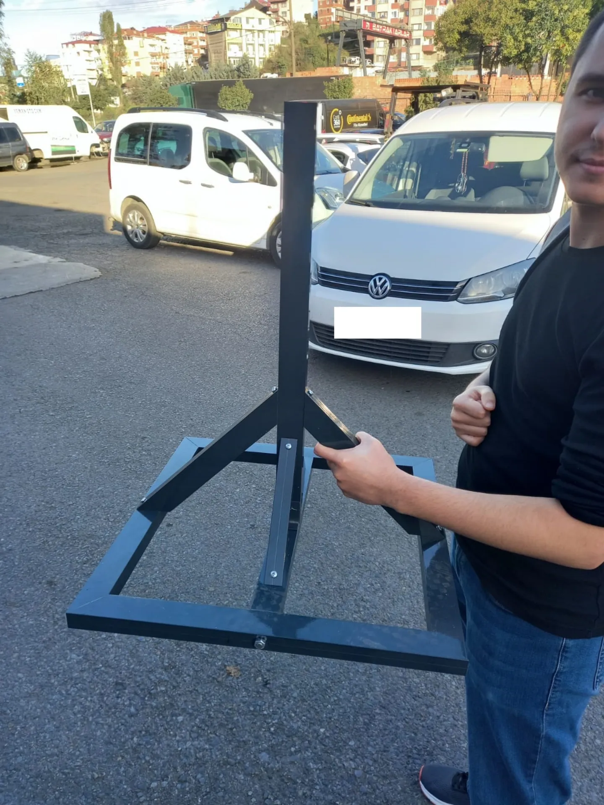</center>

After that, we went to the industry area for threading our shaft in the lathe. Again, they just helped with our project. They gave their time and expertise without any money. I can't thank you enough for their generosity.

Also, we started to design intermediate parts which are then printed from a 3D printer. We designed:

1. A Modified vibration damping casing for Raspberry Pi 3B+ and Navio2
2. A connector to connect tripod ball head to quadrotor
3. A mount to hold infrared sensor
4. A case to fit linear bearing into the aluminum base
5. A fitting to secure connection between shaft and tripod ballhead

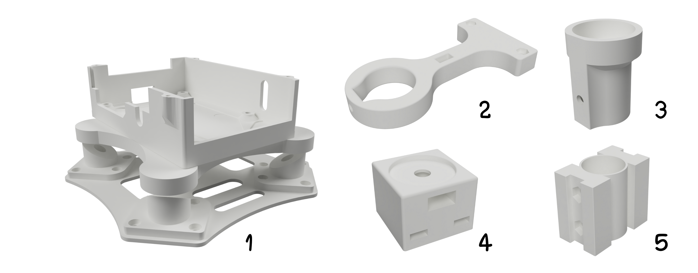

For the quadrotor build there is nothing fancy. We bought a F450 frame, EMAX XA2212 brushless motors, 30A Skywalker ESCs, Raspberry Pi 3B+ and a Navio2 with a power module. We drilled some holes under the frame to connect it with tripod ball-head. After some screwing, soldering and gluing the quadrotor was ready to put on the test-bench. We supplied power through the two LED power supplies that were sitting around.

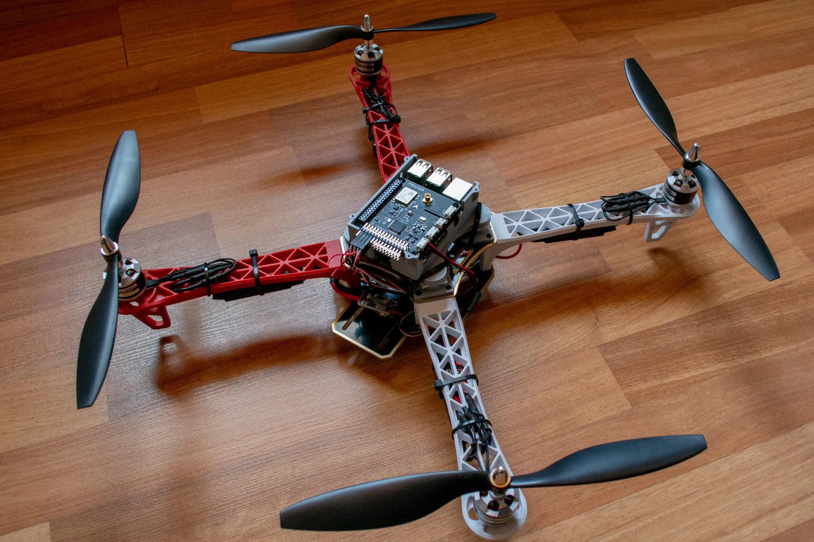

### Sensors and States

Quadrotors rely on a variety of sensors to maintain stable flight and accurate navigation. I want to talk about each sensor briefly.

**The Inertial Measurement Unit (IMU)** is a fundamental sensor that provides critical data on acceleration and angular velocity, crucial for determining the pitch, roll, and yaw of the drone.

A **compass**, or **magnetometer**, measures the Earth's magnetic field to determine the heading or yaw of the quadrotor. Although it is susceptible to errors from magnetic field disturbances, it is vital for correcting the yaw drift from the IMU. Combining data from the IMU and the compass allows the drone to maintain a stable heading.

For outdoor navigation, **GPS** is indispensable, providing global position coordinates (latitude, longitude, and altitude). GPS requires a clear sky view and depends on satellites, limiting it to outdoor use.

The **barometer** measures atmospheric pressure to estimate altitude, offering reliable altitude information, especially outdoors. Combined with GPS, it ensures accurate altitude estimation for stable flight.

When flying indoors, where GPS signals are unavailable, an **optical flow sensor**, **lidar** or **motion tracking system** can be used. Optical flow sensor measures the motion of objects across its field of view, determining the quadrotor's movement relative to the ground and providing vital position information in the XY plane. This enables stable horizontal positioning by estimating the relative movement over surfaces.

**Lidar** (Light Detection and Ranging) is another sensor for quadrotors. It uses laser pulses to measure distances to objects, providing high-resolution 3D mapping of the surroundings. It can be used for tasks such as navigation, collision avoidance, and environment mapping, both indoors and outdoors.

Also these sensors work together through sensor fusion techniques like the **Kalman filter** and **Complementary filters** which blend data from multiple sources to provide a more accurate and stable state estimation.

As a final note about the sensors, it is important to understand which sensor provides which state information. I often see people on forums trying to fly quadrotors indoors without GPS or any alternative sensors. As a result, they don't get position information, yet they expect their quadrotor to hover without sliding on the horizontal axis. This is unrealistic because, without sensors like the optical flow sensor, motion tracking devices or lidars, the quadrotor can not accurately maintain its position indoors. Understanding the roles of each sensor is crucial for achieving stable and controlled flight.

### Vibration Problem

Despite accounting for vibration and designing a damping case, our initial solution did not meet performance expectations. The vibration arose from the interaction of various components such as the aluminum base, shaft, and linear bearing, which caused excessive vibration affecting the flight controller. This vibration was directly proportional to the thrust generated by the propellers. We used a rubber material that is used in closet valve. However, as recommended in the [Ardupilot documentation](https://ardupilot.org/copter/docs/common-vibration-damping.html) about vibration damping, alternative materials like 3M earplugs could potentially offer better vibration isolation.

# How to control a quadrotor?

### Software Needed to Control Quadrotor

Since we opted not to develop flight software for Navio2 from the ground up, we decided to use an existing flight stack. There are two prominent open-source options available: PX4 and Ardupilot. Each project offers distinct advantages and disadvantages concerning licenses, user base, and features. Based on my prior experience with flight software and considering its extensive user community, we selected Ardupilot as our preferred choice. For further comparison, you can conduct your own research to explore their differences in greater detail.

Additionally, we wanted to use ROS with Ardupilot. ROS provides a robust framework for building complex robotic systems, offering functionalities such as communication between nodes, sensor integration, and advanced algorithms for autonomous navigation and perception. This combination allows us to extend the capabilities of our Navio2-based system, enabling interaction between onboard sensors and actuators facilitated by ROS nodes.

To establish communication between Ardupilot and ROS, we rely on [MAVROS](https://github.com/mavlink/mavros) project as the essential link. MAVROS facilitates integration of ROS capabilities with MAVLink-compatible autopilots like ArduPilot.

> MAVLink is a very lightweight messaging protocol for communicating with drones (and between onboard drone components). -_from [MAVLink](https://mavlink.io/en/) website_

In simpler terms, MAVROS sets up ROS with topics and services. These allow ROS to get data from the Ardupilot and send instructions back to it. It's like a translator that helps ROS understand and control what the drone is doing, making the whole system more flexible.

So the system looks like this:

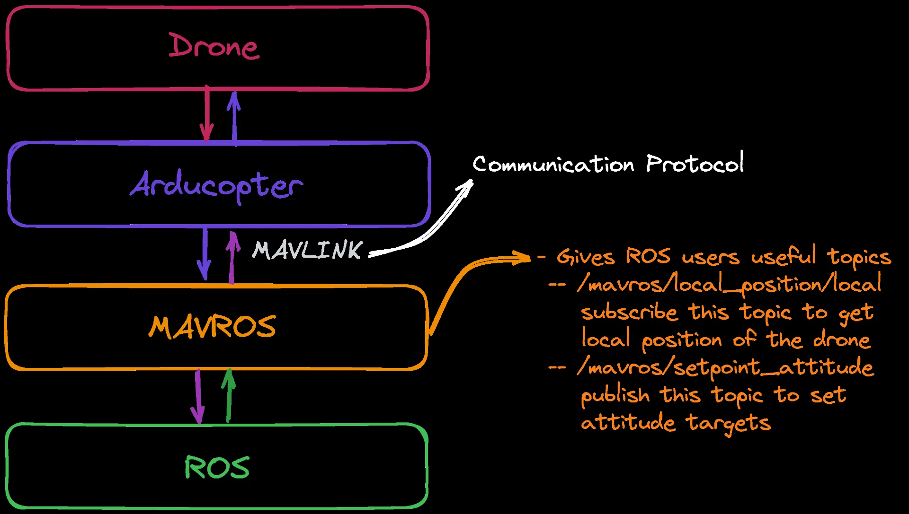

### Control Diagram for Quadrotor

I don't want to make a deep dive into mathematics about how to control a quadrotor. However, a general diagram for controlling a quadrotor can be seen below. I borrowed this image from the Brain Douglas' [Youtube video series](https://www.youtube.com/watch?v=hGcGPUqB67Q) where he talks about how to hover a quadrotor, highly recommended if you want to learn more.

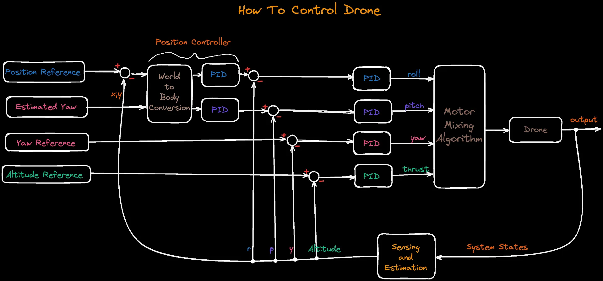
Although this is a general diagram, our system is little bit different because we are only interested in attitude (roll, pitch, yaw) and altitude control on our test-bench which provides 4 degrees of freedom. So our simplified diagram translates to this:

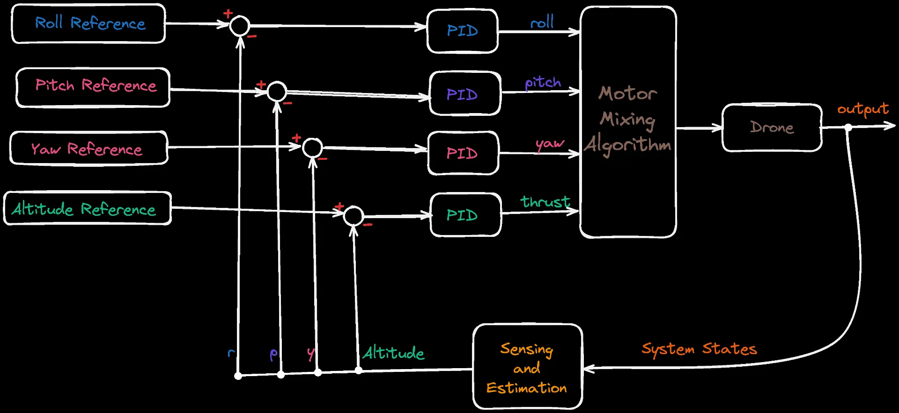
However, don't forget that this is for OUR case where the XY values are not changing on the test-bench. So, this is our theoretical diagram.

Ardupilot adds a level of complexity to this diagram. For attitude control in one axis, diagram becomes:
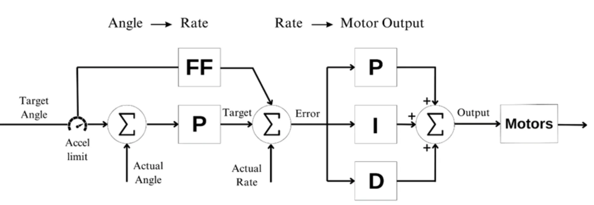
_source: [Ardupilot](https://ardupilot.org/dev/docs/apmcopter-programming-attitude-control-2.html)_

In the process of controlling a drone's movement, we start with translating desired angles like roll and pitch into rates of change—how fast these angles should change over time. This transformation uses a square root controller (P) to adjust these rates based on the difference between where we want the drone to be and where it actually is. We also add feedforward rates to improve performance.

Next, in the Rate to Motor Output stage, the rates of change we calculated are used to determine what actions the motors should take. This step relies on real-time measurements from gyroscopes that tell us how fast the drone is actually moving.

It's important to understand that these commands aren't direct signals to the motors. Instead, they're high-level instructions that are sent to the motor's software, which then translates them into actual movements and adjustments.

In the motor mixing library, each command from the controller corresponds to a specific action for the motors or servos. For example, if the drone receives a roll command of +1.0, it means it should roll as much as possible to the right. Similarly, a pitch command of +1.0 would result in maximum pitch.

By default, Ardupilot uses PID controller as the main controller. However, it doesn't limit you there. It provides a structured way to add your custom controllers. In the Ardupilot source code you can find a template to add your custom controller. Even you can export this custom controller from Simulink.

##### Custom Controller in Simulink

The custom controller library in ArduPilot lets you create and operate your own controller. First, you develop a model of your controller using Simulink. This model is then converted into embedded C++ code. Afterward, this code is added into ArduCopter source code.

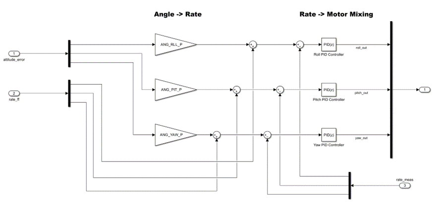

To make everything work on the actual drone, modified ArduCopter source code compiled into a binary. When I am on an embedded computer that is running Linux, I use distcc to distribute jobs in parallel to reduce compile time. You can checkout [my blog](https://www.behlulakbudak.com/icecc/) to learn more about it. Then you can use this binary on your quadrotor.

With this setup, you can experiment with different control strategies while keeping the core functionality of ArduPilot intact. It’s a powerful tool for research, as other ArduPilot users can directly use your custom controller. This makes your work more accessible and beneficial to the community than just using hardware-specific tools.

You can find more detailed information about developing custom controller for Ardupilot [here](https://ardupilot.org/dev/docs/copter-adding-custom-controller.html).

### Spatial Information Acquisition

ArduCopter needs spatial information for position control as we discussed in the sensors section. Outdoors, this is provided by GPS. Indoors, various techniques are used. However, in controlled environments like test-benches, where the drone's horizontal (xy) position is fixed, the focus shifts to accurately measuring vertical (z) axis movements. To achieve this, we use a distance sensor connected to the Navio2's ADC to gather distance data.

The distance sensor sends analog signals to the Navio2’s ADC, which converts them into digital readings. These voltage values represent distances and are then converted into centimeters using a specific formula calibrated for our sensor. You can find various calibration techniques for IR sensors if you search it. This formula helps determine the height by converting voltage value to mm. But sensor data can sometimes be unreliable, showing outliers or irregularities. To tackle this, we use a median filter, which smooths out any outliers or irregular data points by selecting the middle value from a sequence of measurements.
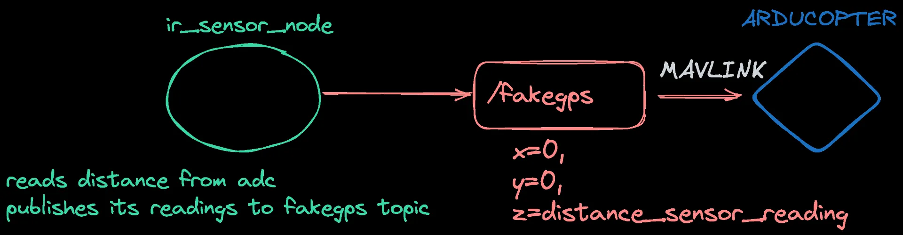
We know the XY information is 0 since we are stationary on the test-bench, and we obtain the height information from the IR sensor. We send this data through the fake_gps plugin found in the mavros_extras package, which extends the capabilities of the mavros package.

### Autonomous Control

For sending commands to quadrotor, we use topics that are provided by the MAVROS.

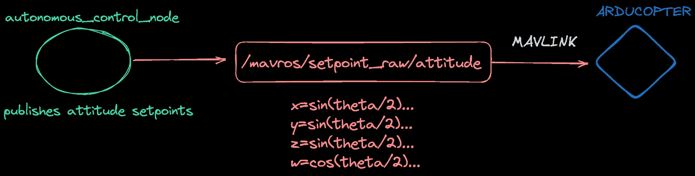
_"/mavros/setpoint_raw/attitude"_ topic accepts the reference points in quaternion. You can make roll-pitch-yaw conversions in ROS with the _"tf"_ package. For example you can send a hover command to drone by creating a AttitudeTarget message:

```cpp
   mavros_msgs::AttitudeTarget att;
   att.header.stamp = ros::Time::now();
   att.header.seq=count;
   att.header.frame_id = 1;

   att.type_mask = 7;
   att.thrust=0.6;
   //just hover
   att.orientation.x=0;
   att.orientation.y=0;
   att.orientation.z=0;
   att.orientation.w=1;


   att_raw_pub.publish(att);
```

Hovering is particularly useful when tuning the parameters of your controller. You can adjust the parameters while the quadrotor is operating on the test bench. There's no need to worry about the quadrotor losing control since it is securely mounted and can't go anywhere. This setup also allows for a clear demonstration of how each parameter change affects the system.

For instance, in a PID controller, you can reduce the P parameter to its minimum and then pull the drone away from its arm to observe how it returns to its setpoint. Be cautious and stay clear of the propellers, as they can cause injury. When you increase the P parameter, you'll notice a more aggressive response if you repeat the test. However, if the P parameter is set too high, the quadrotor will start to oscillate.

Finally, MAVROS provides all kinds of topics and services which you can checkout [here](http://wiki.ros.org/mavros) .

# Cyber-attacks

First things first, we utilized academic models of cyber-attacks and did not employ any exploits or penetration techniques to hack the quadcopter. We simulate DoS(Denial of Service), False Data Injection (FDI) and Ramp attacks. We can briefly explain these:

- DoS attack on a drone is when someone deliberately disrupts the drone's communication or control systems, making it unable to receive commands or carry out its tasks.
- FDI attacks occur through the injection of deceptive data into the targeted data flow of systems.
- Ramp attack is also occur through the injection of deceptive data, however, this data scales with time.

We used a random number generator in C++ to check if the random number is greater than some threshold value. If it is greater then we applied the attacks.

| Param Table               | DoS | FDI          | Ramp                |
| ------------------------- | --- | ------------ | ------------------- |
| Probability of Attack (%) | %60 | %60          | %60                 |
| Injected Data             | -   | rand[-4°,4°] | tx0.5xrand[-2°, 2°] |

# Results

For experiments, we sent a simple sinusoidal shaped roll command, ranging from -12.5 to 12.5 degrees, while the pitch and yaw commands remain steady at zero.

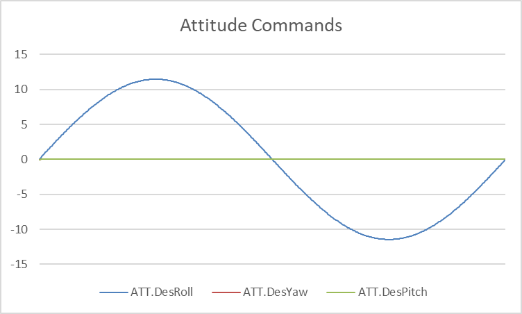

We tuned the PI and PID controllers separately and we compared their performance by applying every attack with same parameters. You can see the resultant graph below.

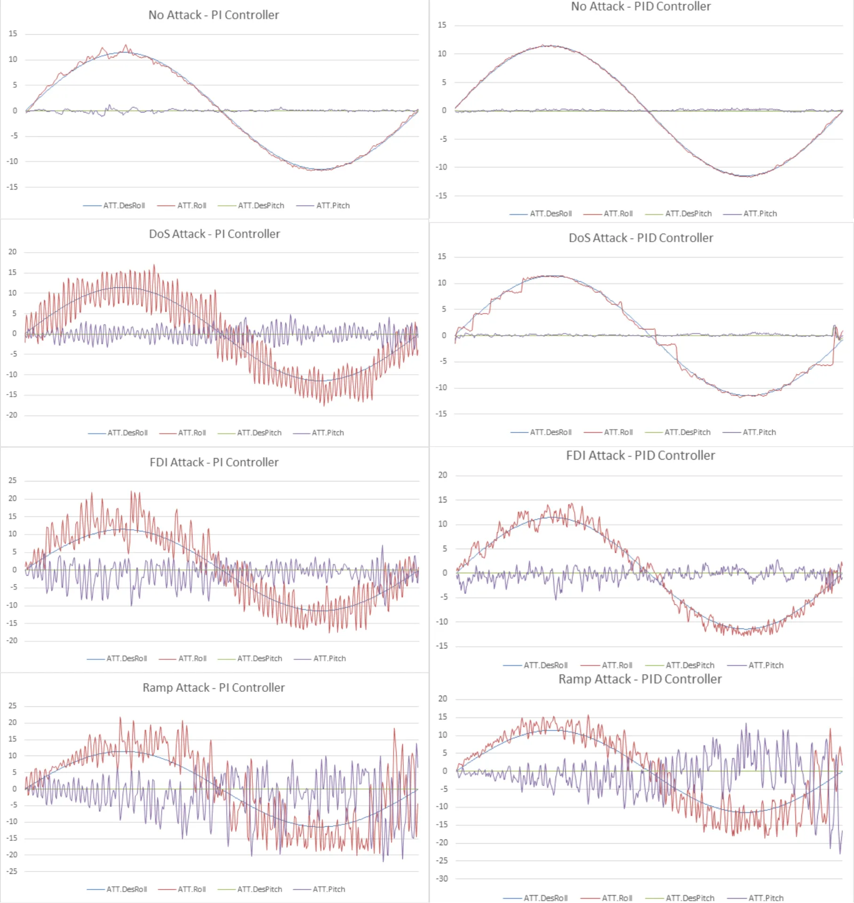

Furthermore, the performance of PI and PID controllers based on ITAE and IAE metrics for the roll, pitch, and yaw axes across different cyber-attack scenarios can be seen below.

|              | **ITAE** |           |         | **IAE**  |           |         |
| ------------ | -------- | --------- | ------- | -------- | --------- | ------- |
|              | **Roll** | **Pitch** | **Yaw** | **Roll** | **Pitch** | **Yaw** |
| **PI**       | 385.24   | 179.3     | 204.6   | 17.91    | 8.92      | 10.18   |
| **PI DoS**   | 3568.6   | 1731.8    | 1925.2  | 145.14   | 64.16     | 72.59   |
| **PI FDI**   | 3860.2   | 2656      | 2777.2  | 157.2    | 116.16    | 152.68  |
| **PI Ramp**  | 6248.5   | 7225.5    | 6225.6  | 208.9    | 239.37    | 229.54  |
| **PID**      | 178.5    | 186.59    | 197.56  | 6.92     | 7.1       | 8.1     |
| **PID DoS**  | 693.32   | 220.41    | 231.22  | 26.36    | 8.617     | 9.24    |
| **PID FDI**  | 1152.49  | 1168.5    | 1199.1  | 49.11    | 50.13     | 61.25   |
| **PID Ramp** | 6174.8   | 4421.9    | 4241.4  | 142.88   | 192.33    | 162.15  |

The PI controller performs good under normal conditions but struggles significantly during DoS, FDI, and ramp attacks, with error metrics rising sharply. On the other hand, the PID controller performs better, with lower error metrics and improved control accuracy. Although it also faces challenges during cyber-attacks, it is more resilient and manages errors more effectively compared to PI controller. Overall, the PID controller outperforms the PI controller, showing greater resilience and better performance in all scenarios.

While our analysis focused on PI and PID controllers, our test bench is designed to accommodate a broader range of control algorithms. This architecture allows us to explore and evaluate various control methodologies beyond just these specific types.

# Conclusion

I wanted to write closing paragraphs because this was our final project and we are graduating from the university. However, I don't feel like writing anything about it except showing my graditude to my family. I want to thank my family—my parents, my brother Burak, and also Şevval and Melih. I am deeply grateful for always being there for me. Thank you.

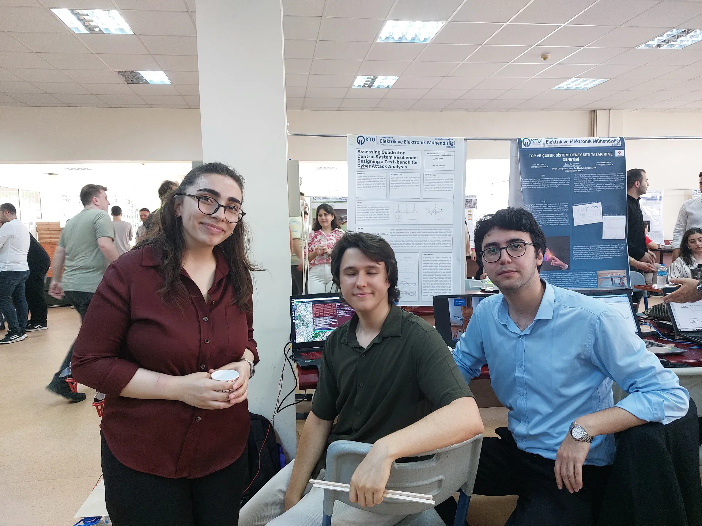
_From left to right: [Şevval](https://tr.linkedin.com/in/%C5%9Fevval-cihat-b50a42269), [Behlül](https://www.linkedin.com/in/behlulsena/)(me) and [Melih](https://www.linkedin.com/in/yildirimelih/)._
