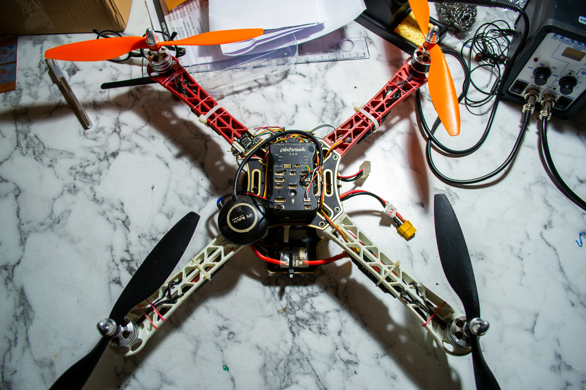

# Introduction

Hey there! This is the very first drone I put together back in my 2018 during high school days. We built this drone to participate in competitions and learn about autonomous control. I took it apart back then, but I've decided to bring it back to life. It has Pixhawk on it as flight controller (FC) and I intend to add an NVIDIA Jetson Nano at top as companion computer.

I'm planning to use this drone for research, mainly focusing on autonomous flight and getting a better grasp of ROS2. I'm also looking into controlling the drone using natural language. One spesific research that caught my attention is [this](https://www.microsoft.com/en-us/research/group/autonomous-systems-group-robotics/articles/chatgpt-for-robotics/).

I will keep this post updated with the project's progress.
