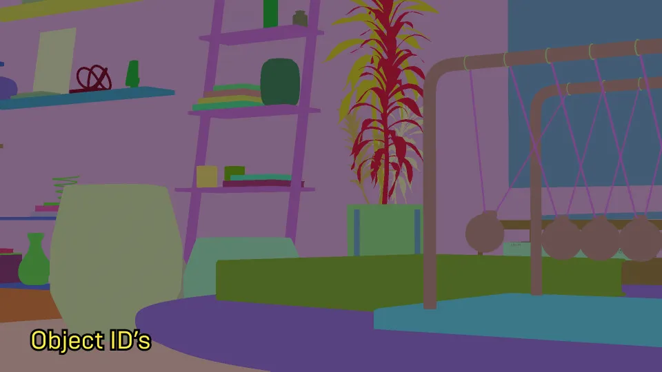
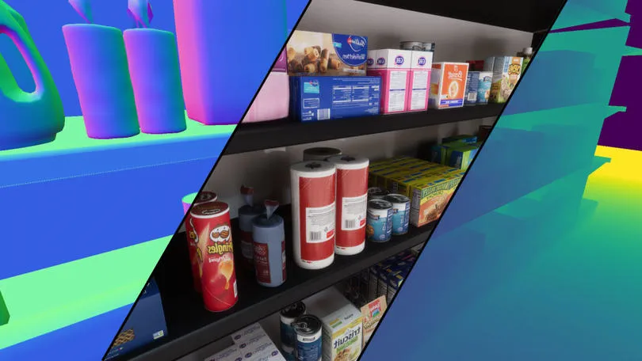
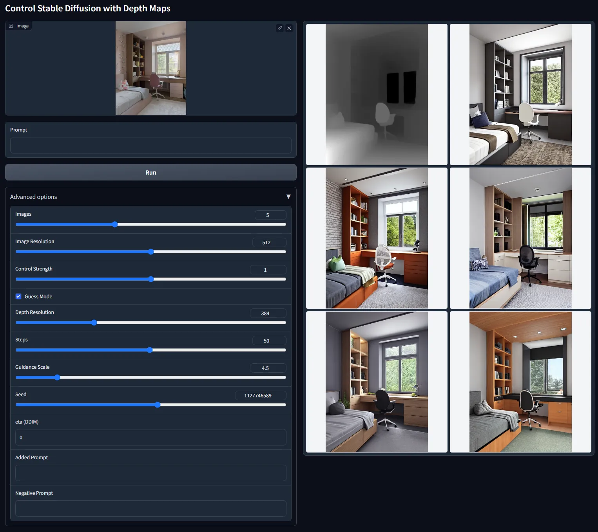

# What is Synthetic Data?

Synthetic data is essentially a fabricated dataset generated by training a computer model to replicate the key features and structure of the original data. In simpler terms, the synthetic data is a fake data that is generated with various techniques based on the real data. This approach can be applied to generate synthetic text, videos, images, or even sound.

# Where is Synthetic Data Used?

Synthetic data serves diverse purposes across multiple industries. Within manufacturing and quality control, synthetic data aids in simulating product scenarios and defects, training machine vision systems to enhance quality assessment. In robotics, synthetic data plays a pivotal role in robot training and simulation, enabling robots to acquire competence in various tasks and environments prior to real-world deployment. In healthcare, synthetic medical imagery and patient data facilitate research, testing of medical imaging equipment, and training machine learning models while preserving patient privacy.

# Why Synthetic Data is Important?

Why do we require synthetic data? The real world might offer a vast expanse of data, but it's not always readily accessible. The hurdles are numerous: it can be slow, costly, and often lacks the diversity needed for robust AI training. Achieving a diverse dataset means capturing data across a multitude of environments, lighting conditions, colors, and objects. In contrast, the digital realm allows for the manipulation of these variables from the comfort of one's chair.

Moreover, synthetic data addresses the challenge of class imbalance in real-world datasets, allowing for the generation of additional samples to balance the representation of different classes, thus improving the performance of AI models across diverse scenarios. Additionally, synthetic data enables the simulation of edge scenarios, enabling researchers and developers to test models against rare and critical events, ensuring the readiness of AI systems for a wide range of situations.

Privacy is another concern. Many organizations and researchers grapple with the challenge of safeguarding sensitive information. Using real-world data can severely limit flexibility in data usage. Synthetic data, however, can be shared more liberally, promoting collaboration and insights without breaching privacy regulations. Researchers can exchange synthetic datasets without the encumbrances of violating stringent data protection regulations, such as the European Union's GDPR or the U.S.'s HIPAA, which impose rigorous standards for safeguarding personal data. In this context, synthetic data becomes a valuable tool for organizations and researchers to maintain compliance, enhance model robustness, and mitigate the risk of data breaches.

# How to Generate Synthetic Data

There are numerous ways to generate different types of synthetic data exists, catering to various data types like text, videos, images, and audio. While my expertise primarily lies in image synthesis, and the rest of the blog will be about synthetic image generation, I'd like to provide you with valuable starting points for working with other types of synthetic data:

- **Text:** One of the most educational videos on LLMs is Andrej Karpathy's 'GPT from scratch' [video](https://www.youtube.com/watch?v=kCc8FmEb1nY). Additionally, for fine-tuning pre-trained models, you might explore the capabilities of LLaMA 2.
- **Video**: The field of synthetic video generation is continuously evolving, with ongoing advancements. A notable example is the work by NVIDIA researchers, who have achieved remarkable results. For more insights, you can refer to their [research](https://research.nvidia.com/labs/toronto-ai/VideoLDM/).
- **Music**: Similar to video generation, synthetic music production is an area that still holds untapped potential. Some of the works I follow are Stability AI's '[Stable Audio](https://stability.ai/stable-audio)' and another [research](https://github.com/Fansesi/Tubitak2204A_2023) that is dedicated to synthesizing classical guitar pieces specifically.

For image generation I'd like to explore different approaches that I used.

## Game Engine Method

These engines offer two valuable advantages. Firstly, they provide the capability to render highly realistic characters and scenes, which can be leveraged to gather data for your deep learning models. Moreover, these engines offer the convenience of arranging scenes according to your specific requirements without leaving your desk. However, it's worth noting that mastering these engines can be a lengthy and demanding process.

Secondly, these engines offer the invaluable advantage of providing precise labels, which are fundamental for training deep learning models. For instance, Unreal Engine supports [render passes](https://docs.unrealengine.com/5.3/en-US/cinematic-render-passes-in-unreal-engine/) that can automatically generate instance segmentation, saving you time and effort. Additionally, you can find various plugins designed specifically for facilitating this process.

Similarly, Unity has its built-in [computer vision tool](https://unity.com/products/computer-vision), allowing you to extract high-quality labels and data for your machine learning tasks with ease. Furthermore, NVIDIA's offering, known as [Isaac Sim](https://developer.nvidia.com/isaac-sim), is a comprehensive solution scaled on Omniverse. It's particularly well-suited for generating synthetic images and training robots.

Another fantastic tool worth exploring is Blender, a robust open-source software. Many individuals are leveraging its capabilities for impressive 3D work. Take a look at this [conference talk](https://conference.blender.org/2022/presentations/1390/) as an example of the synthetic data generation in Blender.

## Generative AI Method

Generative AI has come a long way in the last couple of years. Now, you can create really realistic images with these models by just giving them a simple prompt. It's become much easier to get good results quickly.

Various models have emerged during this time, but one of the most successful ones is the Stable Diffusion, especially with the recent addition of the [SDXL](https://stability.ai/blog/stable-diffusion-sdxl-1-announcement) model. With these models, you can easily generate batches of data for deep learning projects.

  

However, one downside of this method is control. Sometimes, it's tricky to control specific elements, like poses, in these models. But researchers are actively working on this, and they've introduced something called [ControlNet](https://github.com/lllyasviel/ControlNet). With ControlNet, you can give the model a guide, like an image that includes depth information or poses, and it'll use that information to generate content that matches what you're looking for.

While ControlNet provides control over the composition of generated images, it doesn't offer the level of personalization one might desire. For instance, you can describe a character, generate an image you like, and then try generating again with the same description. Surprisingly, the result could be quite different, even if the described features are present in the final image. This undesired variability extends to styles as well.

To address this issue, fine-tuning techniques have emerged as effective solutions. Methods like Dreambooth and LoRa allow you to personalize the images you generate, not only for characters but also for artistic styles. In fact, I have even explored using LoRa fine-tuning method to generate medical melanoma images with minimal resources, which you can read about [here](https://behlulakbudak.com/synthetic-melanoma-images/).

In conclusion, when it comes to generative AI, there remains a challenge in generating synthetic data for deep learning models used in various industries, particularly when aiming to create intricate scenes with complex objects. I think, this challenge persists, despite the capabilities offered by ControlNet and fine-tuning techniques.

## Game Engine + Generative AI Method

We've explored game engines and generative AI independently, but what about combining the two? By merging these technologies, we can effectively mitigate some of their respective limitations.

Using game engines to create synthetic data has its challenges. While the latest Unreal Engine 5 might make it appear effortless to craft stunning scenes, the reality is that it still demands a substantial learning curve. It involves mastering a complex software, understanding principles like Physically Based Rendering (PBR) materials, crafting realistic lighting, and managing large assets that can strain your computer's capabilities, among other intricacies.

On the other hand, when you are solely using generative AI methods, you will not be able to generate perfect labels and, again, you have to label generated images. Moreover, when it comes to creating complex scenes, you might find yourself at a disadvantage, as you lack the reference data needed for precise control, especially when using models like ControlNet. While you could potentially source images from the internet and process them with tools like Midas to create depth maps, this approach is neither scalable nor sustainable for long-term work[^1].

The combination of game engines and generative AI can help address these shortcomings and unlock new possibilities in synthetic data generation.

**What you can do is:**

1. Start by creating a basic scene (artists call that Blockout)
2. Populate the scene with the objects of interest for training, alongside other elements that may act as distractors.
3. Light the scene.
4. Render the scene from your game engine to obtain precise labels for the objects. Generate instance and class segmentation masks.
5. Capture different render passes like depth and normal map, which can be used with ControlNet.
6. Use Stable Diffusion + ControlNet to bring your scene alive by inputting prompts

**An example process:**

1. Create a room and put a chair and a desk, add additional objects around, you could even add spheres, cubes...
2. Place a scissors on the table
3. Illuminate the scene and render it with labels, passes, and masks.
4. Utilize Stable Diffusion and ControlNet to transform the scene into various settings such as an office space, a room belonging to a teenage girl, or a mystical witch's lair...

  

Possibilities are endless. You can get help from ChatGPT to find places where your objects are located.

Finally, I can say this method is the most successful approach for generating synthetic data for non-abstract objects.

# Conclusion

In a nutshell, combining game engines with generative AI is a game-changer in the world of data generation for deep learning. Game engines like Unreal Engine and Unity offer realism and precise labeling, but come with a learning curve. On the other hand, generative AI, with models like Stable Diffusion and ControlNet, simplifies image generation but lacks fine-grained control.

When you bring these technologies together, magic happens. You start with a basic scene in a game engine, add objects, light it up, and get precise labels. Additional details like depth and normal maps are captured for extra control. Then, generative AI models like Stable Diffusion and ControlNet can breathe life into your scene.

This fusion streamlines the data generation process and gives you better control and precision. It's a promising approach with potential across various industries. As both game engines and generative AI keep advancing, this synergy is set to redefine the future of deep learning and AI.

# Notes

[^1]: I'm aware that there are simple pose generators and various tools for integrating them with ControlNet. However, I think they can't not fully replace the capabilities offered by comprehensive game engines.
