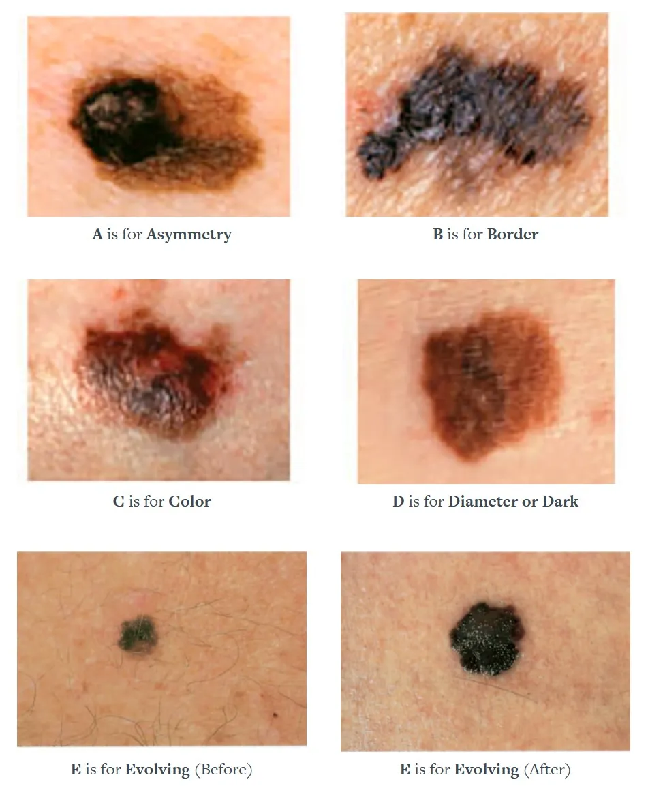
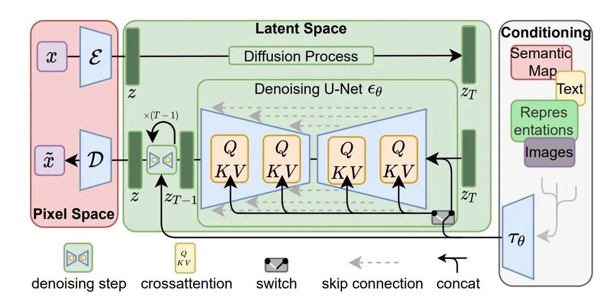
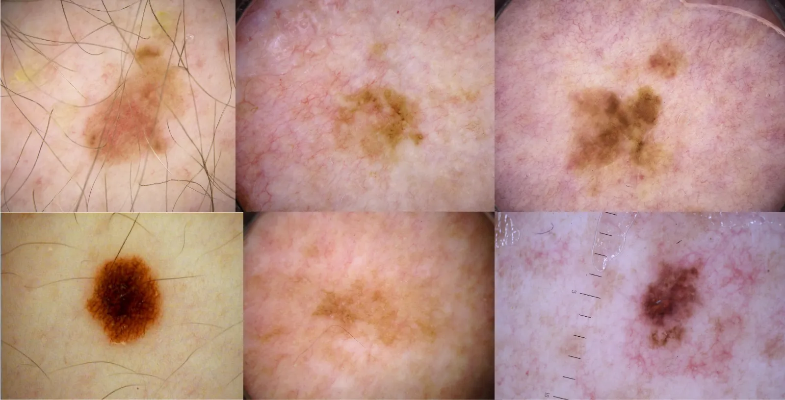
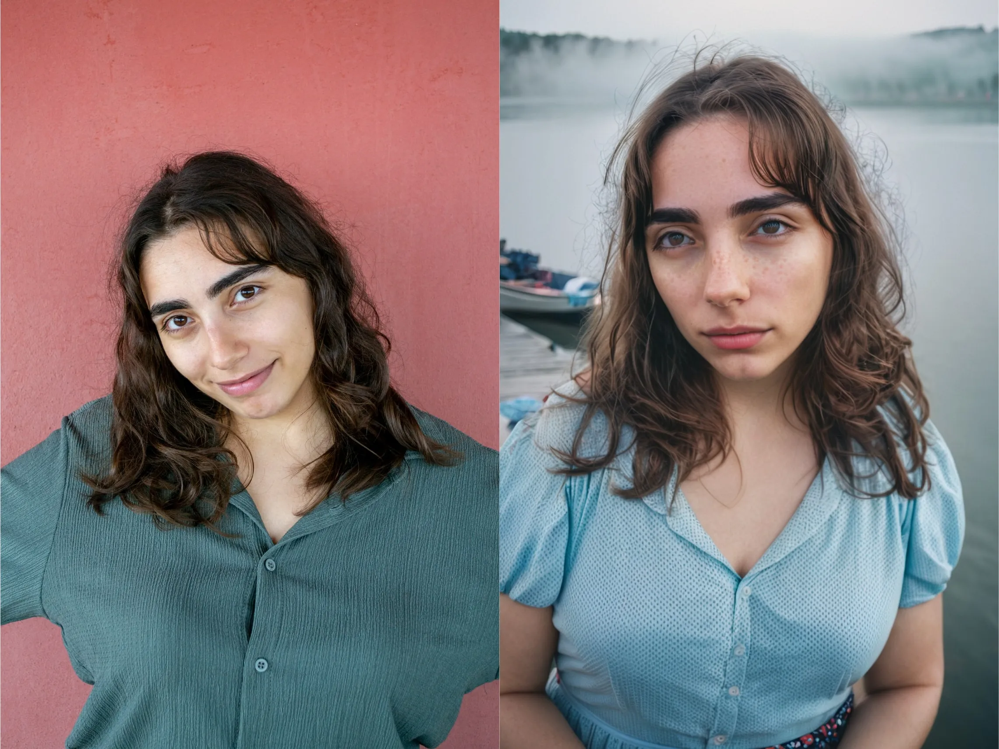
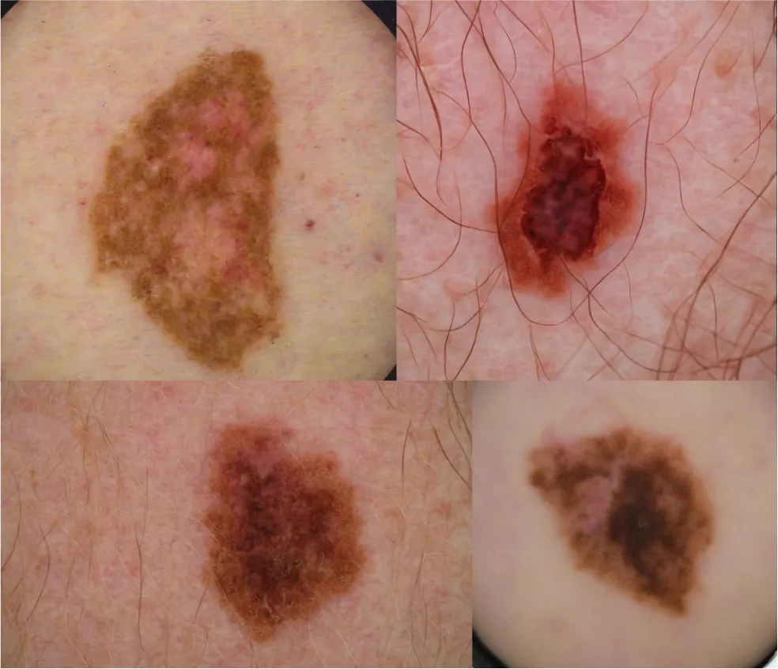

In this blog post, I will explain how I fine-tuned the "Stable Diffusion" with limited resources to generate synthetic malignant melanoma images. The goal of this project was to demonstrate that we can address class imbalance in medical datasets by generating synthetic data, ultimately enabling the training of more robust deep learning models.
Melanoma
We will talk about:

- Brief information about melanoma, role of synthetic data for augmenting rare medical images
- Quick overview of medical image synthesis
- Brief introduction to stable diffusion, what is new in SDXL
- Fine-tuning techniques for SDXL, comparison between them
- Preparing medical skin dataset and fine-tuning SD with LoRa
- Results and discussion

# Melanoma Skin Cancer

Melanoma, a form of skin cancer, arises when melanocytes, the cells responsible for skin pigmentation, undergo uncontrolled growth. This condition is a result of cells in the body losing control over their growth, a hallmark of cancer that can occur in various parts of the body and potentially spread to distant regions.

In many cases, melanoma cells continue to produce melanin, leading to tumors with brown or black pigmentation. However, some melanomas do not synthesize melanin, causing them to exhibit pink, tan, or even white coloration.

Melanomas have the potential to develop anywhere on the skin, though they display a higher likelihood of originating on the trunk (chest and back) in men and on the legs in women. It's important to note that having darkly pigmented skin does reduce the risk of developing melanoma at the more common sites. However, it's crucial to emphasize that **anyone**, including individuals with darker skin, can indeed develop melanoma on the palms of their hands, the soles of their feet, or beneath their nails.

## Melanoma in People of Color

It's worth highlighting that melanoma diagnoses in Black individuals tend to occur at later stages, increasing the risk of severe cases. Darker skin contains a higher number of melanocytes, the pigment-producing cells that offer some level of protection against sun-induced skin damage, including the kind that leads to skin cancer. Darker skin is less prone to sunburn, which has sometimes led to the misconception that Black individuals are immune to skin cancer.

This misconception can result in a lack of skin self-examinations for cancer, delayed medical consultations for skin changes. Moreover, even artificial intelligence systems designed to assist in early cancer detection may fail to adequately identify melanoma on darker skin if they lack a diverse dataset, including representative samples of individuals with darker skin tones.

To address this disparity, the use of synthetic data can play a valuable role in expanding the available data for melanoma detection in Black populations, improving diagnostic accuracy, and ultimately ensuring that all individuals, regardless of their skin tone, receive the appropriate care and attention in the fight against melanoma[^1].

## Key Indicators of Melanoma

Finding melanoma at an early stage is crucial; early detection can vastly increase your chances for cure. The first five letters of the alphabet are a guide to help you recognize the warning signs of melanoma. **A is for Asymmetry**, **B is for Border**, **C is for Color**, **D is for Diameter or Dark**, and **E is for Evolving**. More information can be found [here](https://www.skincancer.org/skin-cancer-information/melanoma/melanoma-warning-signs-and-images/).

<center>  </center>

# Medical Image Synthesis

In the history of medical image synthesis, data scarcity in healthcare has driven the usage of generative models like Generative Adversarial Networks (GANs)[^2] and Variational Autoencoders (VAEs). GANs use a competitive game between a generator and discriminator to create increasingly realistic synthetic data, while VAEs learn a probabilistic mapping to balance data fidelity and diversity in their generated samples. You can find lots of resources on internet about how they work.

GANs are powerful but troubled by learning instability, convergence issues, and mode collapse. On the other hand, VAEs excel in output diversity and avoid mode collapse, but often produce blurry and hazy images. Recent advances, such as denoising diffusion probabilistic models (DDPMs) and latent DDPMs, have outperformed other techniques in generating natural images. Thus, their performance in medical image synthesis is a current research topic.

So, we will be exploring the capabilities of diffusion models, with a special focus on a particular model called the "Stable Diffusion". This model has gained acclaim for its proficiency in generating highly realistic images.

# Stable Diffusion

Basically, Stable Diffusion is a text-to-image model that takes a prompt for input and then outputs an image that corresponds to that. First, they take input data and progressively introduce Gaussian noise in a controlled manner, creating a sort of "noisy" version of the data. This process is like a delicate recipe for noise creation. Then, the real power of these models comes into play. They are trained to reverse this diffusion process, effectively removing the noise and returning clean data from the initially noisy samples.

<center>  </center>
I don't want to deep dive into how Stable Diffusion works but there are great resources that I can suggest for you:

- [Jay Alammar](https://jalammar.github.io/illustrated-stable-diffusion/) explains diffusion models and what is happening behind the stable diffusion with illustrations.
- You can check [Lilian Weng](https://lilianweng.github.io/posts/2021-07-11-diffusion-models/) if you want to learn math behind SD.
- What you are looking for is more practical knowledge, then SD [subreddit](https://www.reddit.com/r/StableDiffusion/) is way to go. You can find practical tips and more resources to get started.

SDXL is the latest version of the stable diffusion. To highlight the differences from the previous version of SD, here's a concise list:

- Larger UNet backbone (three times larger)
- Increased model parameters with more attention blocks
- Introduction of a second text encoder
- Training on multiple aspect ratios
- Addition of a refinement model for improving visual fidelity

So, it's undoubtedly more powerful and capable of generating fantastic results with even shorter prompts.

# Fine-tuning Methods for SD

Training large foundation models like Stable Diffusion from scratch is a formidable task due to their massive computational requirements, extended training times, and complex data needs. So, training these massive models from scratch is a pretty daunting task.

That's why many folks in the field are going for a more practical option. Instead of building everything from the ground up, they're fine-tuning existing pretrained models. It's a smart move because it saves time and resources and still gets you impressive results. However, there is not a single way to fine tune SD models.

#### **Traditional Naive Fine-tuning (NFT)**

This is classic fine-tuning for neural networks. Naive Fine-tuning neural networks means adjusting a pre-trained model for a new task, capitalizing on its prior knowledge while making it more suitable for the specific problem at hand. It alters the original model weights. New model can adapt highly specific use cases without prompt engineering.

However this process requires very large dataset, in terms of SD I recommend minimum dataset size of 1000, and you have to create complex captions for that dataset. Compared to other fine-tuning methods, this technique requires more training steps.

#### Dreambooth

Dreambooth[^3] approach is for "personalization" of text-to-image diffusion models. By providing a few reference images of a subject, the model fine-tunes itself to connect a unique identifier to that specific subject. Then, when you give it a text prompt, it can generate a range of lifelike images, each one capturing the essence of the subject, all while being versatile and creative in different contexts. More info can be found [here](https://huggingface.co/blog/dreambooth).

For Dreambooth training you need to have a dataset of thing you want to train on also you need a regularization dataset. Regularization is used for making the model more robust for over-fitting. However, I have seen some folks that are not using it and still got great results. So, it is a bit trial and error with your dataset, which I think the most important aspect of training, and hyperparameter tuning such as finding a sweet spot for learning rate.

#### LoRa

LoRA[^4] (Low-Rank Adaptation) is a novel technique that originally invented for fine-tuning large-language models. It retains the pre-trained model's core while incorporating trainable rank decomposition matrices into each layer of the Transformer architecture. This strategic move significantly reduces the number of parameters requiring fine-tuning and, notably, alleviates the GPU memory burden.

LoRA focuses on the cross-attention layers on the model, where textual and visual elements intersect. Researchers have found that by fine-tuning this specific aspect of the model, LoRA can achieve remarkable results, making it a compelling choice for optimizing large language models across a range of real-world tasks and applications. In order to train a LoRa, you need images of the subject and corresponding captions for them.

## Comparison

There are also other methods such as textual-inversion and hypernetworks. However, I think their performance are not suitable for medical image synthesizing. So, I will not mention them in this post. Also some people combine some methods together, for example, Dreambooth with textual inversion or LoRa training with Dreambooth style. I haven't tried those myself so I don't have any recommendations about that.

#### Computational Perspective

If we compare these 3 methods in terms of computational intensity: Traditional Fine-tuning > Dreambooth > LoRa. You'll require an A100 or a graphics card with at least 24GB of VRAM for the traditional approach. LoRa and Dreambooth, on the other hand, can be trained with 16GB of VRAM. With further optimization, it's possible to train these methods on machines with 8-12GB of VRAM.

#### Size on Disk

In terms of size, LoRa is the smallest among them. It is only 200 - 600MB in size generally. Other methods alters the original model and saves the whole weights. So they are bigger and take up few gigabytes on disk. This factor becomes important when you want to train different subjects or iterate over same subject with different parameters.

#### Why I Chose LoRa

I chose to use LoRa for this task for some compelling reasons. First, LoRa is lightweight in terms of system requirements, and you can train it even with a free-tier Google Colab using a T4 GPU, making it accessible. It's also speedy to train because it doesn't alter the model's original weights and focuses on a smaller set of parameters. Moreover, LoRa is much smaller in size. It is significantly smaller than traditional checkpoints. Given these advantages, I decided to test the performance of SDXL combined with LoRa in the field of medical imaging.

#### Fine-tuning Based on Your Goal

Ultimately, regardless of the chosen method, the specific aim you pursue determines the duration of training, the requisite hyperparameters, and the size of your dataset. The nature of what you aim to teach the model significantly influences these parameters. For instance, teaching a simple character might demand only 10-100 photos, while introducing intricate details in inference such as wings, requires more images and specific hyperparameters to match. Similarly, teaching a distinct style, like a self-created style such as "_behlulism_," necessitates a more extensive dataset.

In the case of medical images, the need for comprehensive data becomes apparent—gathering all available data becomes crucial for effective training in this domain. Because the base model knows nothing about it and you have to teach that concept. You might wonder, "Why fine-tune the model when it knows nothing about the subject I want to teach?" Well, in this approach, the magic lies in the pretrained weights. They equip the model not just with knowledge of your subject but also with a powerful understanding of what distinctly _isn't_ your subject.

# Data Preparation

The dataset was generated by the International Skin Imaging Collaboration ISIC[^5] and they hosted a competition on Kaggle. In this competition, there were very few melanoma images compared to a ton of healthy ones – just 584 melanoma images and 32,542 healthy ones. To tackle this imbalance, the winning team had to bring in last year's competition dataset because there simply weren't enough melanoma images available[^6].

<center>  </center>

I wanted to use this dataset for fine-tuning SD with LoRa. In order to do that, I need to extract melanoma images from the dataset and also I have to create captions for that images. In CSV file, there is information about the name of the image, gender of the patient, age, and if the mole is malignant or not. I used that information for separating malignant images and captioning them.

To start, I created a simple script that scans the _'train.csv'_ file to identify the malignant melanoma images and extracts them. After separating malignant images, I created another simple script for captioning:

```python
def create_caption(row):
    """Create a caption for an image."""
    sex = row[2]
    anatom_site = row[4]
    age = row[3]
    benign_malignant = row[6]
    if benign_malignant.lower() == 'malignant':
        sex_caption = sex or ""
        anatom_site_caption = f"on {anatom_site}" if anatom_site else ""
        age_caption = f", at age {int(age)}" if age else ""
        caption = f"photo of {sex_caption} skin, melanoma {anatom_site_caption}{age_caption}"
        return caption
    else:
        return None
```

I utilized the data within the CSV file to generate diverse captions based on gender, age, and the anatomical site. Because I wanted more variation in captions, I created a script that analyzes if there is hair in the image.

```python
def process_image(image_path):
	"""Analyze the images if they are hairy or not."""
    # Load the image
    image = cv2.imread(image_path)
    # Convert the image to grayscale
    gray_image = cv2.cvtColor(image, cv2.COLOR_BGR2GRAY)
    # Apply Gaussian blur to reduce noise and improve contour detection
    blurred_image = cv2.GaussianBlur(gray_image, (5, 5), 0)
    # Use Canny edge detection to find edges in the image
    edges = cv2.Canny(blurred_image, 50, 250)
    # Find contours in the edge image
    contours, _ = cv2.findContours(edges, cv2.RETR_EXTERNAL, cv2.CHAIN_APPROX_SIMPLE)
    # Define a minimum contour length threshold to filter out small artifacts
    min_contour_length = 100  
    # Filter out small contours (artifacts)
    filtered_contours = [contour for contour in contours if cv2.arcLength(contour, False) >= min_contour_length]
    total_perimeter = 0
    for contour in filtered_contours:
        perimeter = cv2.arcLength(contour, False)
        total_perimeter += perimeter
    print(f'Total Perimeter: {total_perimeter}')
    name_of_caption = image_path.split(".")
    # If the total perimeter is greater than 4000, add ', hairy' to the caption
    if total_perimeter > 4000:
        # Add ', hairy' to the caption file associated with this image
        caption_filename = name_of_caption[0] + '.caption'
        with open(caption_filename, 'a') as file:
            text_to_add = ', hairy'
            file.write(text_to_add)
```

I think the code is quite self explanatory. Essentially, it identifies edge counters in the images, summing them up to compare against a predefined threshold to determine if there's sufficient hair in the image. When hair is detected, it appends a "hairy" caption to the existing files. It's worth noting that the script is experimental and not without its imperfections, mainly because of the dynamic nature of medical images. That's why I decided to keep it separate from the original captioning script.

Finally, the created captions will be in the format of:
photo of a (sex) skin, me1anoma on (anatom_site), at age (age_approx), (hairy).

# Fine-tuning SD with LoRa

For fine-tuning purposes, I employed the scripts available from [kohya_ss](https://github.com/kohya-ss/sd-scripts). Alternatively, you can also use the [diffusers](https://github.com/huggingface/diffusers/) library from Hugging Face. The kohya_ss repository offers various versions and experimental models, making it worth exploring.

## Base Model

To begin with, LoRa necessitates a base model for training. There are two approaches regarding the choice of base model. Some people advocate consistently using standard checkpoints (pretrained model weights) like SD 1.5 or SDXL 1.0. Others suggest selecting a checkpoint aligned with your specific objectives. For example, if your aim is to generate highly realistic images of the character you're training on, a specialized checkpoint with a focus on realism, such as the one provided [here](https://civitai.com/models/152525/realism-engine-sdxl), should be your choice. On the other hand, if you want to create anime-like images, a base model specialized for anime generation is preferable.

Both approaches make sense, and your choice really depends on what you're trying to achieve. If you want to transfer yourself or a real world person into the world of SD, then those checkpoints with a focus on realism are great because they understand how real people look and give you a head start while fine-tuning. However, if you want to capture a specific style or something unique, like medical images, it's better to go with base models like SDXL 1.0 or SD 1.5. They're less biased towards any specific outcome.

## Note on Beauty Standards of Models

I want to highlight that these models often aim to produce images that align with what are considered 'stereotypical beauty standards', focusing on achieving 'perfect' body and facial features. During my experimentation with these models and fine-tuning processes, I wanted to transfer my girlfriend to the world of SD. She has a beautiful feature, a charming nasal hump on her nose. However, when generating images, we often struggled to retain this nasal hump in the resulting images because the model tends to prioritize conforming to these conventional beauty norms. In response to this, there are even checkpoints available that specifically aim to depict more natural [humans](https://civitai.com/models/98755/humans).

<center>  </center>

_One of the best resuls we achieved; left real right synthetic_

I'd love to delve deeper into this topic and explore the biases in these models, for example race and gender discrimination is hugely biased in these models, but that would be a whole new blog subject. In the meantime, you can check out [this article](https://www.bloomberg.com/graphics/2023-generative-ai-bias/).

## Training Configs

### LoRa Configs

LoRa comes in various types, including LoRA-C3Lier, LoHa, and DyLoRA. Each type alters the kernel size of the 2D convolution layer and makes adjustments to the architecture. You can find more information on the internet. For this project, I'll be using Kohya's standard LoRa, which has been renamed as 'LoRA-LierLa'. Two specific configurations need to be set for this model:

**network_dim:** The network dimensions, or rank, indicates how many parameters of the Unet/TE to train. The higher the value, the greater the "expressive power" of the model, but at the expense of larger file size. Most of the time 64 is suffice if you want to train something generic. However, when dealing with more specialized subjects 128 is a better choice. In the case of medical images, I choose my rank as 128.

**network_alpha:** Network alpha is like a learning control knob – it's there to put the brakes on or, in other words, dampen the learning process. Essentially, it's used to adjust the model's weights during saving to prevent any rounding errors that might mess up some of the weight values.
Setting alpha to 0 or making it equal to network dimensions (net dim) doesn't apply any dampening. However, when set to 1, it introduces significant dampening, requiring more training steps or a higher learning rate. A comparison of different scaling options is provided below:

Alpha 0 = Alpha 128 = 128/128 = x1

Alpha 1 = 1/128 = x0.0078125

Alpha 64 = 64/128 = x0.5

Alpha 128 = 128/128 = x1

Alpha 256 = 256/128 = x2

When in doubt, you can set it equal to the network_dim.

### Optimizer Configs

In my opinion, AdamW stands out as one of the best optimizers available for this task, provided your system can handle the computational cost. If you're working with budget constraints, an alternative optimizer to consider is Adafactor. It uses less memory by only storing partial information from previous gradients. Another solid choice is the 8-bit version of AdamW, known as AdamW8bit.

As a note, AdamW8bit performed better than Adafactor in my case. However, I encourage you to experiment and explore options to see what works best for your particular project.

As learning rate, I think it is also highly dependent on what you are trying to achieve. I have seen that the value of it can range anywhere from 4e-7, which is the standard learning rate for SDXL, to 8e-5. It is highly dependent on the dataset. If you are trying to teach a usual concept like a person, it is safe to increase it. However, if you are trying to teach a more unique concept, like medical images, lowering it down will be more beneficial. And don't forget that as you decrease the learning rate, you have to train the model longer.

I use a constant learning rate scheduler with a warm-up period of 100 steps. While some people recommend the cosine learning rate scheduler for better performance, I believe it can be a bit of a trial-and-error process to find the right fit for your dataset.

### General Config

For my other configurations, I typically set the number of repeats to 1 while aiming to maximize the number of epochs. There's a parameter that determines how frequently the training script saves snapshots of the current model status. This periodic saving also triggers an inference run on the model with a predefined input prompt for testing. I monitor the generated images closely to determine whether LoRa is ready for the task. If it starts producing images with noticeable artifacts, it's usually a sign of overfitting.

# Results and Discussion

I trained several LoRa models. I used different learning rates, optimizers, and schedulers that I talked about through this blog post. Finally, I achieved some satisfactory results.

<center>  </center>
For inference I used:

- Sampler: Eular a, DPM++ 2M/3M Karras

* 20-30 Sampling steps
* 7.5-9 CFG Scale

When I applied to the ABCDE rule that we talked about in [medical images section](#medical-image-synthesis) to the synthesized images, I have seen that the most of the generations passed the test. However, when I looked at carefully for some images, I have seen that some of them are little blurry like the lower right corner. I think the reason for that could be the dataset.

Following that, I decided to present a set of synthetic images to a group of professionals I am acquainted with. I explained the process and asked them to distinguish the synthetic images from the real ones. After examining the images, we engaged in a discussion about their observations and methodology. The professionals mentioned that they often perceived an image as synthetic when it exhibited fewer details. However, there was a complication as some real images in the dataset were quite simple and were mistakenly labeled as synthetic. Additionally, they encountered challenges when some complex synthetic images, which included elements like hair or red dots, were incorrectly identified as real by the examiners.

The results are promising, though not perfect at this stage. To further this project, collaboration with pathologists and dermatologists is essential. I firmly believe that the application of diffusion models in generating synthetic medical images holds great potential in this field.

Remarkably, I find it quite astonishing that by simply fine-tuning with LoRa, we are able to generate medical images. This process has shown a realm of new exciting possibilities for me. It's especially significant due to the remarkably low costs involved, both in terms of system resources and time. Additionally, the compact model weights make it convenient to store and re-train various LoRas, offering substantial versatility for various applications.

# References and Notes

All the code I wrote can be found in this [repo](https://github.com/lioga/melanoma-stable-diffusion).

[^1]: In order to achieve that task at least some amount of data is required to train generative AI model.
[^2]: Chen, R.J., Lu, M.Y., Chen, T.Y. _et al._ Synthetic data in machine learning for medicine and healthcare. _Nat Biomed Eng_ **5**, 493–497 (2021). https://doi.org/10.1038/s41551-021-00751-8
[^3]: https://arxiv.org/abs/2208.12242
[^4]: https://arxiv.org/abs/2106.09685
[^5]: Rotemberg, V., Kurtansky, N., Betz-Stablein, B., Caffery, L., Chousakos, E., Codella, N., Combalia, M., Dusza, S., Guitera, P., Gutman, D., Halpern, A., Helba, B., Kittler, H., Kose, K., Langer, S., Lioprys, K., Malvehy, J., Musthaq, S., Nanda, J., Reiter, O., Shih, G., Stratigos, A., Tschandl, P., Weber, J. & Soyer, P. A patient-centric dataset of images and metadata for identifying melanomas using clinical context. Sci Data 8, 34 (2021). https://doi.org/10.1038/s41597-021-00815-z
[^6]: https://arxiv.org/abs/2010.05351
